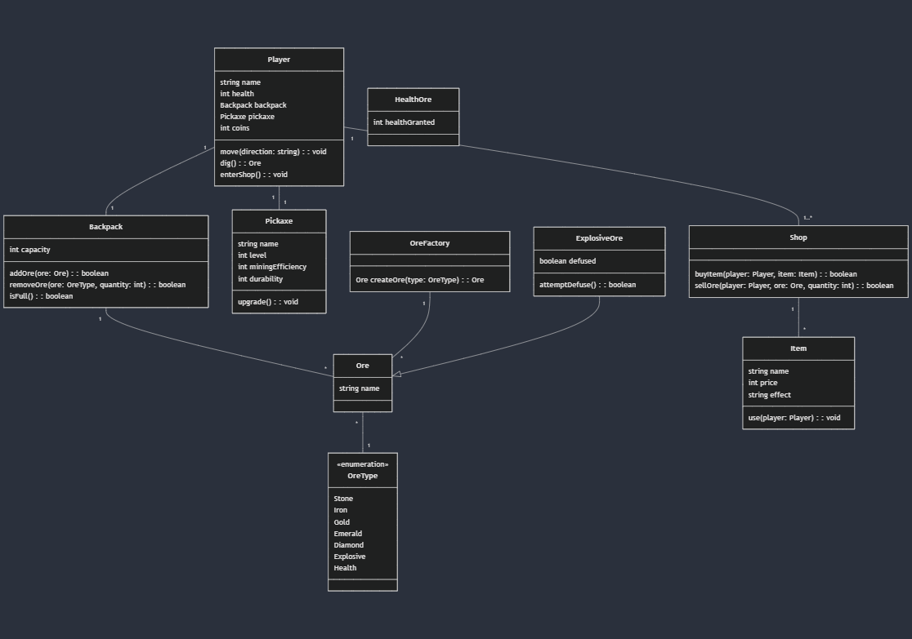

# Final Project

-   [ ] Read the [project requirements](https://vikramsinghmtl.github.io/420-5P6-Game-Programming/project/requirements).
-   [ ] Replace the sample proposal below with the one for your game idea.
-   [ ] Get the proposal greenlit by Vik.
-   [ ] Place any assets in `assets/` and remember to update `src/config.json`.
-   [ ] Decide on a height and width inside `src/globals.js`. The height and width will most likely be determined based on the size of the assets you find.
-   [ ] Start building the individual components of your game, constantly referring to the proposal you wrote to keep yourself on track.
-   [ ] Good luck, you got this!

---

# Dig It Up

## ✒️ Description

In this tycoon/simulator game, the player tries to mine different ores to get a better pickaxe and make coins. The user goes to a certain block on the map and mine it and then will have a random chance at any of the ores in the game. There will be a chance that the user gets explosive ore and if the user does not have a defuse kit (purchaseable from the shop) they will blow up and lose some ores/gems/coins and health. The shop will contain pickaxe upgrades, health potions and defuse kits all purchaseable for coins which are obtained by selling ores/gems. The goal of the game is to get the max pickaxe to escape the mine. The user will use w a s d to move and space bar to dig. To enter the shop it will be tab and mouse in the shop.

## 🕹️ Gameplay

Players begin with a low level pickaxe and must explore to find ore pockets and mine them. They must mine enough to upgrade a pickaxe which provides more loot when mining ores. The player can either sell or hold 
ores in the backpack with a limited amount of space per type of ore. If the user finds an explosive ore they will have to defuse it with a defuse kit bought from the shop, if it isn't defused, used can pay a certain amount of coins to try and defuse it but still a chance to explode and lose a % of hearts gems and coins.

## 📃 Requirements

> [!note]
> This was a web project so that's why you'll see requirements about logging in and uploading data which for you is irrelevant. Focus more on the requirements describing actions taken for gameplay.

1. The user shall register to be able to login.
2. The user shall login to be able to play a game.
3. The user shall upload a valid deck file.
4. The user shall upload a valid cards file.
5. The user shall upload a valid abilities file.
6. The user shall select which deck they will use in the game.
7. The user shall select which deck the AI will use in the game.
8. The system shall "flip a coin" to decide which player goes first.
9. The system shall shuffle the user's deck.
10. The system shall draw the top 7 cards from the user's deck.
11. If the user does not have a Basic Pokémon in their hand the system shall "mulligan" until they do.
12. Upon each mulligan, the AI shall draw a card.
13. The user shall put one of their Basic Pokémon face down as their Active Pokémon.
14. The user shall put up to 5 more Basic Pokémon face down on their Bench.
15. Upon a new turn, the system shall draw a card from the deck of the current player.
16. Upon a new turn, the system shall place the drawn card in the hand of the current player.
17. The user shall put (up to 5 total) Basic Pokémon cards from their hand onto their Bench.
18. The user shall Evolve their Pokémon as many times as they choose.
19. The user shall attach an Energy card from their hand to one of their Pokémon once per turn.
20. The user shall play Trainer cards (as many as they want, but only one Supporter card and one Stadium card per turn).
21. The user shall Retreat their Active Pokémon once per turn.
22. The user shall use as many Abilities as they choose.
23. The user shall attack the opponent's Active Pokémon.
24. After a player attacks, the system shall end their turn and start their opponent's turn.
25. The system shall execute any "special conditions" after a turn is over.
26. The user shall pick a Victory Card when the opposing Active Pokémon dies.

### 🤖 State Diagram

> [!note]
> Remember that you'll need diagrams for not only game states but entity states as well.

](https://mermaid.live/edit#pako:eNp9kD9rAzEMxb-K0ZzjoKOHQuAodGiXGwLBizirPpGzbPynEEK-e3xN0xAC1fQk_fRA7wRTsAQacsFCA6NL6LvvFyOq1btdWJzqule1w-Wwaq12_bYf-0HFRDmTfSIHdu5KjhEneuRuNiv4e6PVZ1AssZZn5F-v2_LBayvssXAQ9cbCeaZsBDbgKXlk2x49rccGykyeDOgmLaaDASPnxmEtYTzKBLqkShtIoboZ9BcuuXU12ntKf9OIsg_h3pPlEtLHNdefeM8XYhd09g))

### 🗺️ Class Diagram

### 🧵 Wireframes

> [!note]
> Your wireframes don't have to be super polished. They can even be black/white and hand drawn. I'm just looking for a rough idea about what you're visualizing.

-   _Let's Play_ will navigate to the main game.
-   _Upload Cards_ will navigation to the forms for uploading and parsing the data files for the game.
-   _Change Log_ will navigate the user to a page with a list of features/changes that have been implemented throughout the development of the game.

We want to keep the GUI as simple and clear as possible by having cards with relevant images to act as a way for the user to intuitively navigate the game. We want to implement a layout that would look like as if one were playing a match of the Pokémon Trading Card Game with physical cards in real life. Clicking on any of the cards will reveal that card's details to the player.

### 🎨 Assets

We used [app.diagrams.net](https://app.diagrams.net/) to create the wireframes. Wireframes are the equivalent to the skeleton of a web app since they are used to describe the functionality of the product and the users experience.

We plan on following trends already found in other trading card video games, such as Pokémon Trading Card Game Online, Hearthstone, Magic the Gathering Arena, and Gwent.

The GUI will be kept simple and playful, as to make sure the game is easy to understand what each component does and is, as well as light hearted to keep to the Pokémon theme.

#### 🖼️ Images

-   Most images will be used from the well known community driven wikipedia site, [Bulbapedia](https://bulbapedia.bulbagarden.net/wiki/Main_Page).
-   Especially their [Trading Card Game section](<https://bulbapedia.bulbagarden.net/wiki/Full_Art_card_(TCG)>).

#### ✏️ Fonts

For fonts, a simple sans-serif like Roboto will look quite nice. It's a font that is legible, light on storage size, and fun to keep with the theme we're going for. We also used a more cartoonish Pokemon font for the title screen.

-   [Pokemon](https://www.dafont.com/pokemon.font)
-   [Roboto](https://fonts.google.com/specimen/Roboto)

#### 🔊 Sounds

All sounds were taken from [freesound.org](https://freesound.org) for the actions pertaining to cards.

-   [Shuffle cards](https://freesound.org/people/VKProduktion/sounds/217502/)
-   [Flip card](https://freesound.org/people/Splashdust/sounds/84322/)

### 📚 References

-   [Pokemon Rulebook](http://assets.pokemon.com/assets/cms2/pdf/trading-card-game/rulebook/xy8-rulebook-en.pdf)
