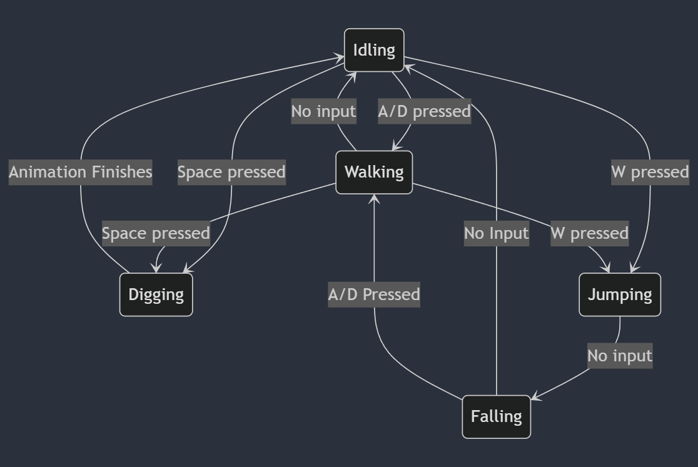

# Dig It Up

## ✒️ Description

In this tycoon/simulator game in 2D, like mario, the player tries to mine different ores to get a better pickaxe and make coins. The user goes to a certain block on the map and mine it and then will have a random chance at any of the ores in the game. There will be a chance that the user gets explosive ore and if the user does not have a defuse kit (purchaseable from the shop) they will blow up and lose some ores/gems/coins and health. The shop will contain pickaxe upgrades, health potions and defuse kits all purchaseable for coins which are obtained by selling ores/gems. The goal of the game is to get the max pickaxe to escape the mine. The user will use w a s d to move and space bar to dig. To enter the shop it will be tab and mouse in the shop.

## 🕹️ Gameplay

Players begin with a low level pickaxe and must explore to find ore pockets and mine them. They must mine enough to upgrade a pickaxe which provides more loot when mining ores. The player can either sell or hold 
ores in the backpack with a limited amount of space per type of ore. If the user finds an explosive ore they will have to defuse it with a defuse kit bought from the shop, if it isn't defused, used can pay a certain amount of coins to try and defuse it but still a chance to explode and lose a % of hearts gems and coins.

## 📃 Requirements

1. The user be able to move in all directions (2d).
2. The user shall be able to mine a block.
3. The user shall be able to open the shop.
4. The user shall be able to buy an item.
5. The user shall be able to sell ores.
6. The user shall be able to open a backpack.
7. The user shall upgrade their pickaxe.
8. The user shall be able to defuse explosive ore.
9. The system shall decide which ore the user gets after mining.
10. The system shall decide how much an ore is worth after mining.
11. The system shall decide how many ore the user gets.
13. The user shall lose a life when not being able to defuse an explosive ore.
14. The system will end the game when user loses all lives.
15. The user is able to buy an item which ends the game (user wins).
16. The system decides how much hp the explosive ore does upon explosion.
17. The system decides how much health the user will get from a health ore.
    

### 🤖 State Diagram

Player State Diagram

Block State Diagram

### 🗺️ Class Diagram

### 🧵 Wireframes

-   User can walk and look around and mine different blocks for different rewards
-   User can press tab to open the shop
-   User can press b to open the backpack

After pressing B, the user will have a view of the inventory which shows the amount of coins and ores the user is currently holding.

After pressing tab the user will be able to open the shop and view what each product they can buy does for them and how much it will cost, etc.

### 🎨 Assets

#### 🖼️ Images

-   Most images will be used from various Itch.io projects and some have been hand made:
-   [Ores](https://verysmallsquares.itch.io/free-16-bit-ores-sprite-sheet)
-   [Miner](https://elthen.itch.io/2d-pixel-art-dwarf-miner)
-   [Coin](https://uaeuzai.itch.io/coin-sprite)
-   [Cave Background](https://stock.adobe.com/ca/images/Pixel-art-stone%2C-gravel-with-dark-background.-Dungeon-texture-tile-pattern%2C-/940486312?as_campaign=TinEye&as_content=tineye_match&continue-checkout=1&token=EC-8JE79745U9011701M)
-   [Shop Keeper](https://slowdevelopment.itch.io/shop-with-shopkeeper)
-   [Pickaxes](https://shield-arc.itch.io/free-16x16-pickaxes)

#### ✏️ Fonts

For fonts, I searched for a dwarven mines type of font, but then once I tried it I realized how small the pixels were and so I just went with the ones that looked the nicest.

-   [Canterbury](https://www.1001fonts.com/canterbury-font.html)
-   [5x5 font](https://www.dafont.com/5x5.font)

#### 🔊 Sounds

All sounds were taken from [freesound.org](https://freesound.org) for the actions of mining blocks, purchasing items and everything else.

-   [Pickaxe](https://freesound.org/people/NoisyRedFox/sounds/760567/)
-   [Transaction](https://freesound.org/people/DominikBraun/sounds/483507/)
-   [Explosion](https://freesound.org/people/Joao_Janz/sounds/478278/)
-   [Swing](https://freesound.org/people/InspectorJ/sounds/394426/)
-   [Beeping](https://freesound.org/people/SamsterBirdies/sounds/467882/)
-   [Elevator](https://freesound.org/people/azumarill/sounds/528218/)
-   [Item Pickup](https://freesound.org/people/el_boss/sounds/665182/)
-   More to come.
